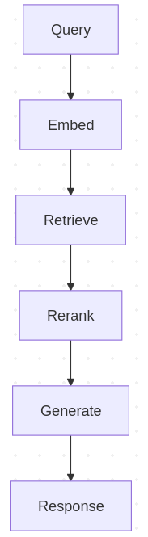
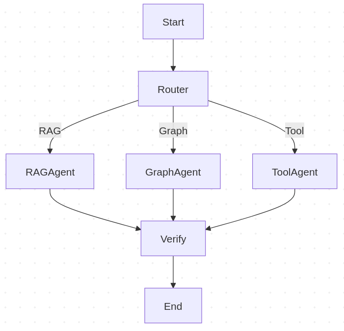
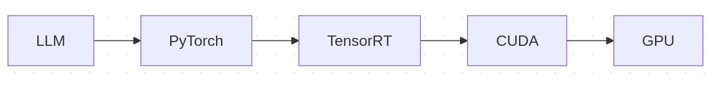
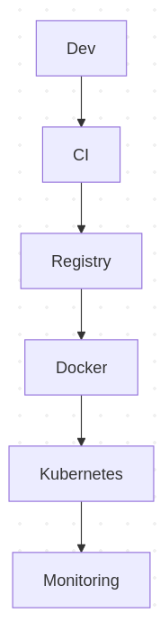

# Technical Design — NVIDIA-Optimized Generative AI Platform

**Author:** Santosh Narayanan  
**Status:** Active / OSS  
**Audience:** AI Engineers, Platform Architects, OSS Contributors

---

## 1. Introduction

This document describes the **technical architecture and design decisions** behind the **NVIDIA-Optimized Generative AI Platform**. The goal of this project is to provide a **clear, production-oriented reference architecture** for building:

- GPU-accelerated RAG systems
- Deterministic, agentic AI workflows
- Cloud- and container-ready AI platforms

The design intentionally balances:
- **Practical local development** (single GPU / laptop)
- **Enterprise-grade patterns** (microservices, orchestration, observability)
- **Extensibility** (pluggable vector stores, models, agents)

---

## 2. Design Goals & Principles

### 2.1 Core Goals

- Support **high-performance Generative AI workflows** using NVIDIA GPUs
- Provide **dual vector store support**:
  - Qdrant (default, production-ready)
  - FAISS (GPU-accelerated, local / benchmarking)
- Enable **RAG + Agentic AI** using LangChain and LangGraph
- Be **cloud-ready but laptop-friendly**
- Serve as a **reference OSS architecture** for AI engineers

### 2.2 Design Principles

- **Separation of concerns** (API, orchestration, inference, storage)
- **Explicit orchestration** over implicit chains (LangGraph DAGs)
- **Config-driven extensibility** (vector store, models, tools)
- **GPU-aware design** (clear CUDA and inference boundaries)

---

## 3. Conceptual System Architecture (Reference)

The following diagram represents the **conceptual end-to-end architecture** of the platform. It highlights how frontend clients, API services, orchestration layers, vector/graph storage, model inference, and NVIDIA GPU acceleration interact.

```
┌────────────────────────────────────────────────────────────────────────┐
│                           Frontend / Clients                           │
│  • React UI (optional)  • CLI  • Postman                               │
└───────────────▲───────────────────────────────┬─────────────────────────┘
                │ HTTP / gRPC                   │
        ┌───────┴───────────────────────────────▼───────┐
        │            API & Orchestration Services        │
        │  • FastAPI (auth, rate limit, tracing)         │
        │  • /query, /ingest endpoints                   │
        └───────▲───────────────────────────────┬───────┘
                │ Orchestration (LLM pipelines) │
        ┌───────┴───────────────────────────────▼───────┐
        │        LangChain / LangGraph (RAG & Agents)    │
        │  • Tools (web, code, vector DB)                │
        │  • Graph of steps (retrieve→rerank→generate)   │
        └───────▲──────────────────────┬────────────────┘
                │                      │
     ┌──────────┘                      └──────────┐
     │                                           │
┌────┴─────┐                               ┌─────┴─────────────────┐
│ Vector &  │                               │  Model Inference     │
│ Graph DB  │<──embeddings / search──►      │  • PyTorch runtime   │
│ • FAISS   │                               │  • TensorRT (opt)    │
│ • Qdrant  │◄──graph context (optional)    │  • cuDNN kernels     │
│ • Neo4j   │                               └─────▲─────────────────┘
└────▲──────┘                                     │
     │                                    CUDA runtime + drivers
     │                                    (e.g. RTX 3050 Ti, CUDA 13)
     │                                             │
     │                                     ┌───────┴────────┐
     │                                     │   NVIDIA GPU    │
     │                                     │ (compute, mem)  │
     │                                     └─────────────────┘
     │
┌────┴───────────────────────────────────────────────────────────────┐
│        Platform / Ops (Single Node or Cluster Simulation)           │
│  • Docker + NVIDIA Container Toolkit (GPU pass-through)             │
│  • Kubernetes / Minikube (Helm deploys)                              │
│  • NGC containers (PyTorch, TensorRT, Triton)                        │
│  • Monitoring: DCGM → Prometheus → Grafana                           │
│  • CI/CD: GitHub Actions                                             │
└────────────────────────────────────────────────────────────────────┘

┌──────────────────────────────┐      ┌─────────────────────────────┐
│   Storage / Datasets         │      │  Secrets / Config           │
│ • NVMe SSD (docs, chunks)    │      │  • .env / K8s Secrets       │
│ • Object store (optional)    │      │  • Helm values              │
└──────────────────────────────┘      └─────────────────────────────┘
```

This diagram serves as the **authoritative conceptual reference** for all detailed diagrams that follow.

---

## 4. High-Level Architecture (Mermaid)

> **Placeholder** — High-level system view showing major components and data flow.


---

## 5. RAG Pipeline Architecture (Mermaid)

> **Placeholder** — Retrieval-Augmented Generation flow.




---

## 6. Agent Orchestration with LangGraph (Mermaid)

> **Placeholder** — Deterministic agent DAG using LangGraph.
>



---

## 7. NVIDIA GPU & Inference Architecture (Mermaid)

> **Placeholder** — GPU execution and optimization flow.



---

## 8. Platform, Ops & Deployment (Mermaid)

> **Placeholder** — Deployment and observability view.



---

## 9. Security, Config & Secrets

- Environment-based configuration (.env)
- Kubernetes Secrets for sensitive values
- JWT-based API authentication
- Optional API key enforcement for inference

---

## 10. Observability & Monitoring

- Structured application logs
- NVIDIA DCGM exporter for GPU metrics
- Prometheus for metrics aggregation
- Grafana dashboards for visualization

---

## 11. Extensibility & Future Enhancements

- Additional vector stores (Pinecone, Weaviate)
- Multi-tenant collection management
- Triton Inference Server integration
- Advanced agent memory and planning

---

**End of Technical Design**

